# ForgePPT 系统架构文档

> 本文档描述 ForgePPT 的完整系统架构，包含服务分层、数据流、工作流引擎和 LLM 工具系统。

---

## 1. 总体架构概览

ForgePPT 采用**多语言微服务架构**，由四个核心服务组成：

| 服务 | 技术栈 | 端口 | 职责 |
|------|--------|------|------|
| **frontend** | React 18 + Vite + React Flow | 5173 | 可视化工作流画布 |
| **gateway** | Rust Axum | 3000 | API 网关、CORS、限流、SSE、代理 |
| **python-worker** | Python FastAPI + LangGraph | 8000 | AI 编辑管道、PPTX 解析/重组 |
| **qdrant** | Qdrant 向量数据库 | 6333/6334 | 用户偏好嵌入存储 |

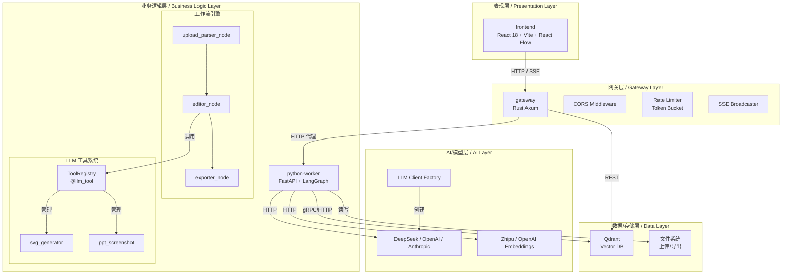

---

## 2. 分层架构详解

### 2.1 表现层 (Presentation Layer)

**位置:** `frontend/`

**核心组件:**
- **FlowCanvas** — React Flow v12 画布，包含 3 个固定节点（上传解析器 → 编辑器 → 导出器）
- **ParamPanel** — 右侧参数面板，根据选中节点显示不同操作界面
- **HeaderBar** — 顶部工具栏

**状态管理 (Zustand):**
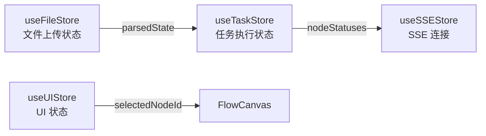

| Store | 关键状态 | 核心 Action |
|-------|----------|-------------|
| `useFileStore` | `fileName`, `parsedState`, `isUploading` | `uploadFile(file)` |
| `useTaskStore` | `taskId`, `overallStatus`, `exportPath`, `isExecuting` | `createTask(pptState, editRequests)` |
| `useSSEStore` | `connected`, `messages[]` | 自动重连 (指数退避) |
| `useUIStore` | `sidebarOpen`, `selectedNodeId`, `toasts[]` | `addToast()`, `toggleSidebar()` |

---

### 2.2 网关层 (Gateway Layer)

**位置:** `src/`

**职责:** 统一 HTTP 入口，所有前端请求先到达 Gateway，再被代理到下游服务。

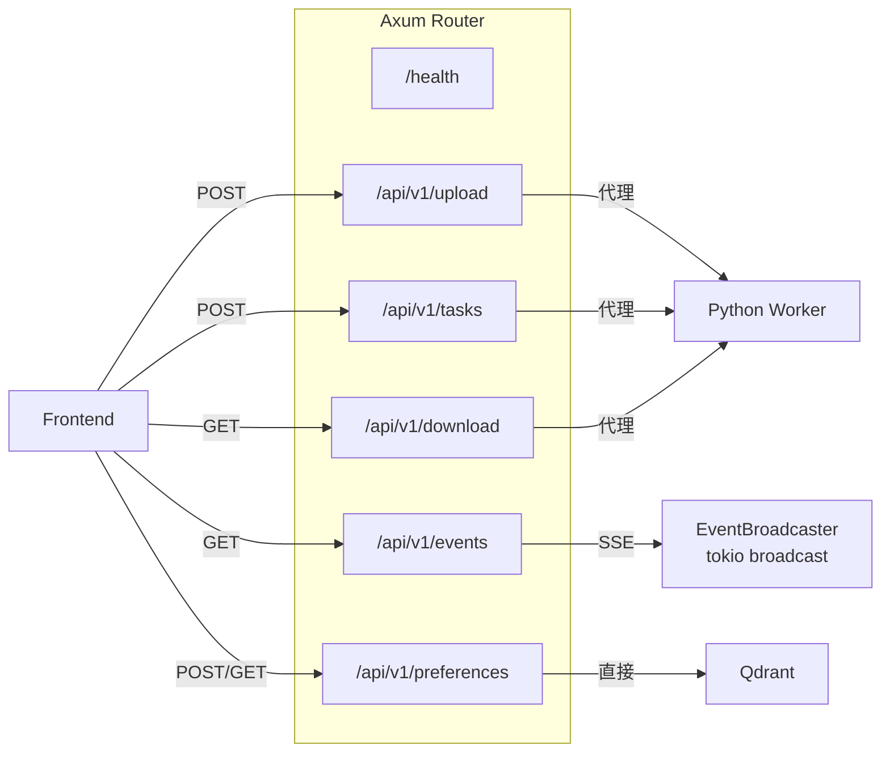

**中间件栈:**
```
CORS → Rate Limit → Trace
```

| 中间件 | 实现 | 说明 |
|--------|------|------|
| CORS | `tower-http::cors` | 允许前端跨域访问 |
| Rate Limit | DashMap + Token Bucket | 默认 60 req/min，按 IP 限流 |
| Trace | `tower_http::trace` | 请求/响应日志 |

---

### 2.3 业务逻辑层 (Business Logic Layer)

**位置:** `python_worker/`

#### 2.3.1 API 路由层

| 路由 | 处理器 | 功能 |
|------|--------|------|
| `POST /api/v1/upload` | `upload.py` | 接收 PPTX → 保存文件 → 解析为 PPTState JSON |
| `POST /api/v1/tasks` | `tasks.py` | 构建 GraphState → 执行 LangGraph → 返回结果 |
| `GET /api/v1/download` | `download.py` | 根据路径返回 PPTX 文件 |

#### 2.3.2 LangGraph 工作流引擎


**GraphState 结构:**
```python
{
    "ppt_state": dict | None,       # 解析后的 PPT 状态
    "edit_requests": list[dict],    # 用户编辑指令
    "edit_results": list[dict],     # 执行结果
    "export_path": str | None,      # 导出文件路径
    "error": str | None,            # 致命错误
}
```

**Editor 子节点路由:**

```mermaid
flowchart TD
    ED["editor_node"] -->|type="refine"| TR["text_refiner_node"]
    ED -->|type="placeholder"| SV["svg_placeholder_node"]
    ED -->|type="theme"| TH["theme_refiner_node"]

    TR -->|结构化输出| RO["RefinerOutput<br/>refined_text"]
    SV -->|结构化输出| SO["SVGOutput<br/>svg_xml"]
    TH -->|结构化输出| TO["ThemeOutput<br/>color_palette, font_size_multiplier"]
```

---

### 2.4 AI/模型层 (AI Layer)

**位置:** `python_worker/llm/`

#### 2.4.1 LLM 客户端工厂

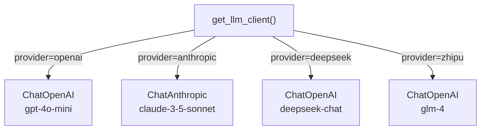

#### 2.4.2 LLM 工具系统架构

```mermaid
flowchart TD
    subgraph "工具注册"
        DEC["@llm_tool<br/>装饰器"]
        REG["ToolRegistry<br/>Singleton"]
        DEF["ToolDefinition<br/>name, description, roles, input_model, func"]
    end

    subgraph "工具实例"
        SVG["svg_generator<br/>roles=[editor]"]
        SCR["ppt_screenshot<br/>roles=[editor]"]
    end

    subgraph "运行时绑定"
        ED["editor_node"]
        ST["StructuredTool.from_function()"]
        BIND["llm.bind_tools(lc_tools)"]
    end

    DEC -->|注册| REG
    SVG -->|注册| REG
    SCR -->|注册| REG
    REG -->|get_tools_for_role("editor")| ED
    ED -->|包装| ST
    ST -->|绑定| BIND
```

**工具调用流程:**
```
1. editor_node 从 ToolRegistry 获取 editor 角色的工具列表
2. 将每个 ToolDefinition 包装为 LangChain StructuredTool
3. 调用 llm.bind_tools(lc_tools) 告知 LLM 可用工具
4. LLM 可选择生成 tool_calls
5. （当前状态）工具绑定已就绪，但尚未实现 Tool Calling Loop
```

**当前限制:** 子节点同时使用 `bind_tools` 和 `with_structured_output`，两者存在冲突。要实现真正的工具调用，需要改为 **Agent Loop** 模式：调用 LLM → 检查 tool_calls → 执行工具 → 追加结果 → 重新调用，直到 LLM 给出最终答案。

---

### 2.5 数据/存储层 (Data Layer)

#### 2.5.1 向量数据库 (Qdrant)

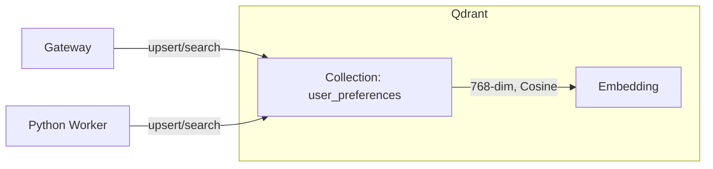

| 属性 | 值 |
|------|-----|
| Collection | `user_preferences` |
| 维度 | 768 |
| 距离度量 | Cosine |
| 嵌入模型 | `text-embedding-3-small` (OpenAI) / `embedding-3` (Zhipu) |

#### 2.5.2 文件系统

| 类型 | 路径 | 说明 |
|------|------|------|
| 上传文件 | `/tmp/forgeppt_uploads/<filename>` | 持久保存，供重组器使用 |
| 导出文件 | `/tmp/forgeppt_output_<name>.pptx` | 编辑后生成的 PPTX |

---

## 3. 端到端数据流

### 3.1 上传流程

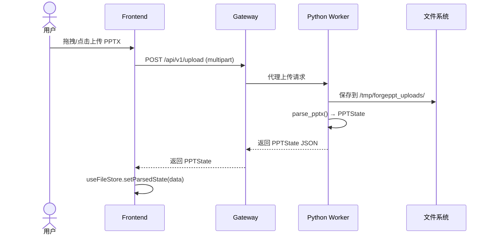

### 3.2 编辑执行流程

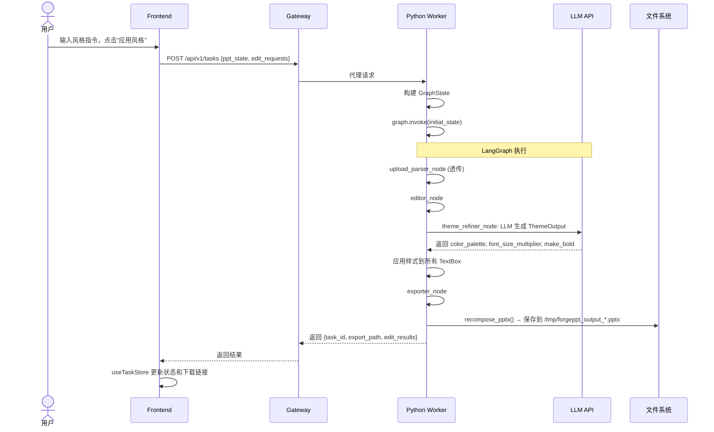

### 3.3 下载流程

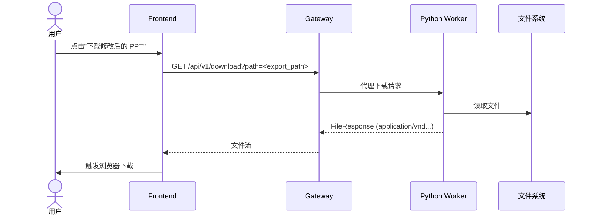

---

## 4. 核心数据模型

### 4.1 PPTState (跨语言契约)

```python
class PPTState(BaseModel):
    slides: list[Slide]
    slide_count: int
    global_props: dict
    source_file: str | None   # 原始文件路径，供重组器使用

class Slide(BaseModel):
    slide_id: str
    page_num: int             # 1-3（限制）
    elements: list[TextBox | Image]

class TextBox(BaseModel):
    text_id: str
    content: str
    position: Position
    size: Size
    style: TextStyle

class TextStyle(BaseModel):
    font_size_pt: float
    font_color: str           # #RRGGBB
    bold: bool
    italic: bool
    alignment: str
```

### 4.2 EditRequest / EditResult

```python
class EditRequest(BaseModel):
    type: Literal["refine", "placeholder", "theme"]
    prompt: str
    text_id: str | None
    style_hint: str | None

class EditResult(BaseModel):
    request_id: str
    status: Literal["completed", "failed", "filtered"]
    new_content: str | None
    svg_xml: str | None
    error: str | None
```

---

## 5. 模块依赖关系

### 5.1 Python Worker 内部依赖

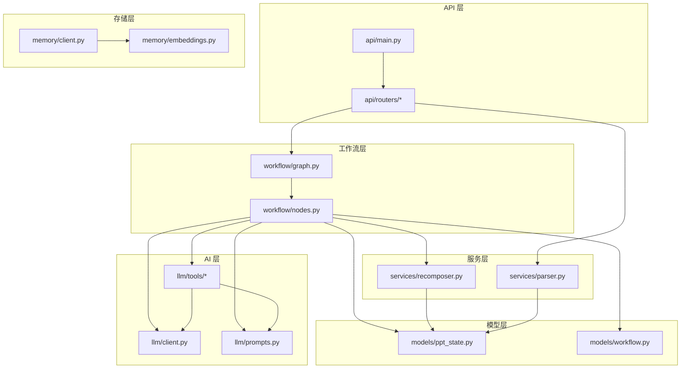

### 5.2 前端模块依赖

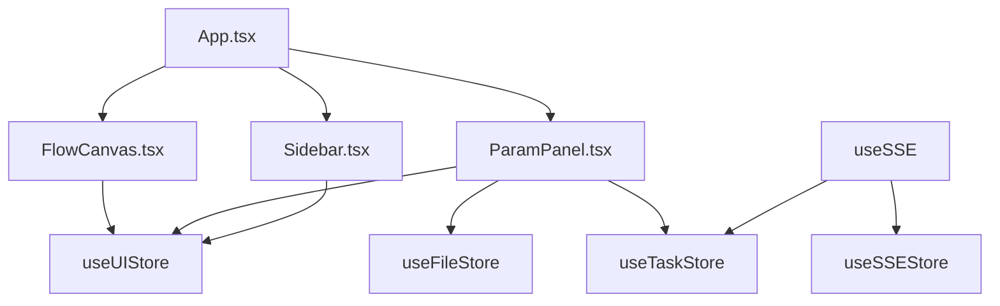

---

## 6. 部署架构

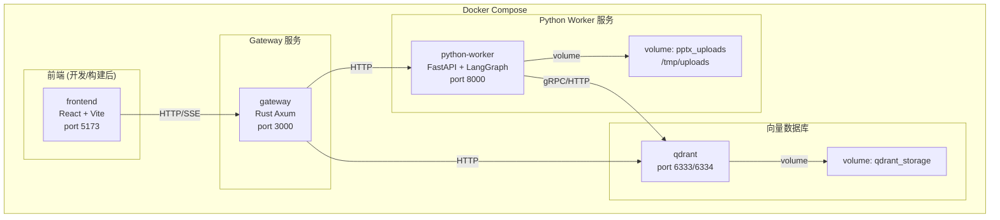

---

## 7. 已知限制与演进方向

| 当前限制 | 演进方向 |
|----------|----------|
| 任务同步执行 (`graph.invoke`) | 异步任务队列 (Celery / RQ) + 后台执行 |
| SSE  broadcaster 存在但未充分利用实时进度 | 节点级 SSE 事件推送 |
| 工具绑定就绪但无 Tool Calling Loop | 实现 Agent Loop 或 LangGraph `create_react_agent` |
| 单次编辑请求顺序执行 | 批量并行编辑 |
| 前端画布节点固定不可配置 | 动态节点拖拽配置 |
| 缺乏持久任务历史 | 数据库持久化任务记录 |

---

> 最后更新: 2026-05-14
